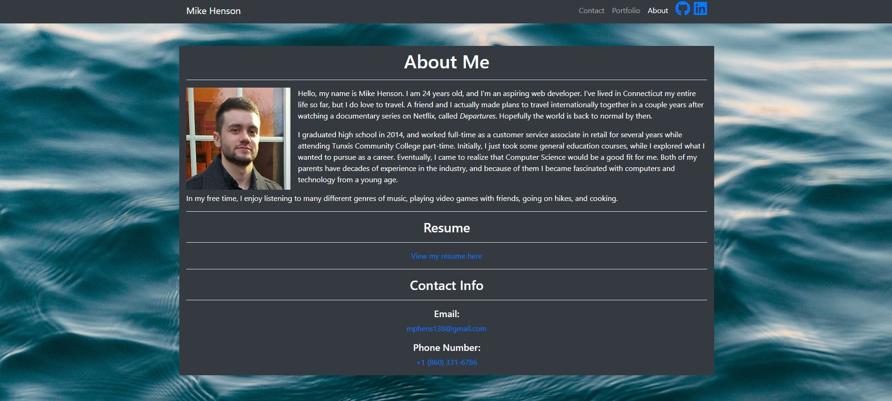

# Responsive Portfolio Project

## Description

This portfolio was made with bootstrap.

It contains:

* Semantic HTML.  

* A responsive layout.  

* Responsive images.  

* An about me page, which consists of a brief autobiography, an image of myself, link to my resume and contact info.

* A page which showcases my first project, called No Waste Kitchen, a Day Planner app, and a Weather Dashboard app.

* A contact page, which has a form with 2 text inputs (one for name, and one for email) as well as a textarea tag, where the user can type their message for me.  

* Each page has the same navbar, with functional links.  

## Website

Visit the live website here:  

[Portfolio](https://mikeh138.github.io/mhenson-responsive-portfolio/)  

## Credits

No Waste Kitchen was a group project, built by Pete Izzo, Adriana Valdiglesias and myself.

## Code of Conduct

  

## License

&copy; 2021 Mike Henson

Licensed under the [MIT](LICENSE.txt) license.
